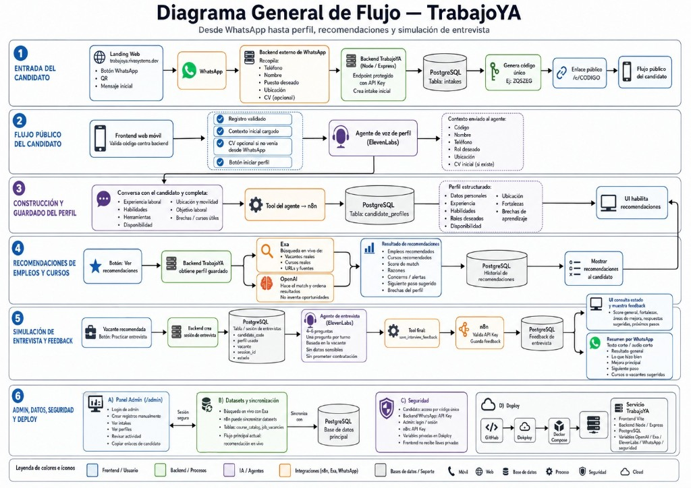

# cv-api-wp

Agente WhatsApp para registro de CV en TrabajoYa. Construido con NestJS, Zavu, PostgreSQL, Redis y BullMQ.

## Qué hace

- Recibe mensajes WhatsApp vía webhooks de [Zavu](https://zavu.dev)
- Guía al candidato por un flujo conversacional: nombre → CV → registro en TrabajoYa
- Expone un panel de administración con métricas, sesiones y logs
- Permite enviar notas de voz generadas con ElevenLabs TTS
- Permite enviar mensajes de texto WhatsApp vía API externa

## Requisitos

- Node.js 22+
- pnpm
- Docker (Postgres + Redis)

## Setup local

```bash
cp .env.example .env
pnpm install
docker compose up -d postgres redis
pnpm exec prisma migrate deploy
pnpm run prisma:seed
pnpm run start:dev
```

La API queda disponible en `http://localhost:3000`.

## Documentación de API

Referencia completa de endpoints, autenticación, payloads y errores:

**[docs/API.md](docs/API.md)**

### Resumen de endpoints

| Método | Ruta | Auth | Descripción |
|--------|------|------|-------------|
| GET | `/health` | — | Health check (Postgres + Redis) |
| POST | `/webhooks/zavu` | Firma HMAC | Webhook entrante de Zavu |
| POST | `/api/voice/send` | `X-Api-Key` | Enviar nota de voz WhatsApp (TTS) |
| POST | `/api/message/send` | `X-Api-Key` | Enviar mensaje de texto WhatsApp |
| POST | `/admin/api/auth/login` | — | Login del panel admin |
| GET | `/admin/api/auth/me` | JWT | Usuario autenticado |
| GET | `/admin/api/stats` | JWT | Métricas generales |
| GET | `/admin/api/sessions` | JWT | Listar sesiones WhatsApp |
| GET | `/admin/api/sessions/:waNumber` | JWT | Detalle de sesión |
| GET | `/admin/api/messages` | JWT | Listar mensajes |
| GET | `/admin/api/analytics/funnel` | JWT | Funnel de conversación |
| GET | `/admin/api/webhook-events` | JWT | Eventos webhook |
| GET | `/admin/api/webhook-events/:id` | JWT | Detalle de evento |
| GET | `/admin/api/request-captures` | JWT | Requests capturados |
| GET | `/admin/api/request-captures/:id` | JWT | Detalle de request |
| GET | `/admin/` | — | Panel de administración (SPA) |
| GET | `/media/audio/:file` | — | Archivos de audio generados |

## Arquitectura



```
WhatsApp → Zavu → POST /webhooks/zavu
                        ↓
                   BullMQ (Redis)
                        ↓
              ConversationProcessor
                        ↓
         ConversationService → TrabajoYa API
                        ↓
              ZavuService (respuesta WhatsApp)
```

| Componente | Tecnología |
|------------|------------|
| Framework | NestJS 11 |
| Base de datos | PostgreSQL + Prisma |
| Cola de jobs | BullMQ + Redis |
| Mensajería | Zavu SDK (`@zavudev/sdk`) |
| TTS | ElevenLabs API |
| Auth admin | JWT + bcrypt |
| Logs | Pino |

## Variables de entorno

Copiar `.env.example` y configurar:

| Variable | Requerida | Descripción |
|----------|-----------|-------------|
| `DATABASE_URL` | Sí | PostgreSQL connection string |
| `REDIS_HOST` | Sí | Host de Redis |
| `ZAVUDEV_API_KEY` | Sí | API key de Zavu |
| `ZAVU_WEBHOOK_SECRET` | Sí | Secret para verificar webhooks |
| `JWT_SECRET` | Prod | Secret para tokens JWT |
| `TRABAJOYA_INTAKE_API_KEY` | Sí | API key de TrabajoYa |
| `VOICE_API_KEY` | Outbound | API key para `/api/voice/send` y `/api/message/send` |
| `PUBLIC_BASE_URL` | Voice | URL pública para servir audio |
| `ELEVENLABS_API_KEY` | Voice | API key de ElevenLabs |
| `ELEVENLABS_VOICE_ID` | Voice | ID de voz para TTS |

Ver `.env.example` para la lista completa con valores por defecto.

## Deploy

```bash
docker compose up -d
```

El contenedor `api` ejecuta migraciones, seed y arranca la aplicación automáticamente.

Variables requeridas en producción: `DATABASE_URL`, `REDIS_HOST`, `ZAVUDEV_API_KEY`, `ZAVU_WEBHOOK_SECRET`, `JWT_SECRET`, `TRABAJOYA_INTAKE_API_KEY`.

## Panel de administración

Acceder a `/admin/` con las credenciales del seed:

- Usuario: `admin` (configurable con `ADMIN_USERNAME`)
- Contraseña: `trabajoya2024` (configurable con `ADMIN_PASSWORD`)
